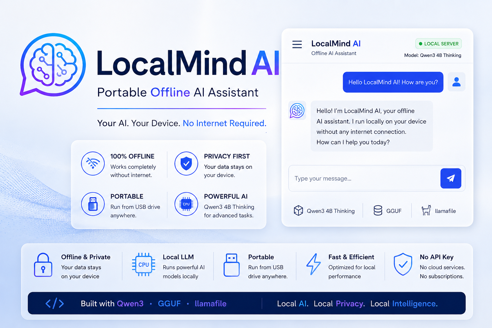

# 🧠 LocalMind AI

### Portable Offline AI Assistant



> **Your AI. Your Device. No Internet Required.**

LocalMind AI is a portable offline AI assistant that runs a Large Language Model locally on Windows without requiring a cloud API or internet connection.

The current version uses **Qwen3 4B Thinking 2507**, **GGUF Q4_K_M**, and **llamafile 0.10.5**.

---

## ✨ Features

* 🤖 Local AI inference
* 🔒 Privacy-focused
* 🌐 No cloud API
* 📡 Offline operation
* 💾 USB portable
* 🧠 Qwen3 4B Thinking 2507
* ⚡ Q4_K_M quantization
* 🖥️ Local browser interface
* 🚀 Simple `Start.bat` launcher

---

## 🛠️ Technology Stack

| Component    | Technology             |
| ------------ | ---------------------- |
| AI Model     | Qwen3 4B Thinking 2507 |
| Model Format | GGUF                   |
| Quantization | Q4_K_M                 |
| Inference    | llamafile 0.10.5       |
| Interface    | Local Web UI           |
| Platform     | Windows                |
| Deployment   | USB / Local            |
| Internet     | Not Required           |

---

## 📁 Project Structure

```text
LocalMind-AI/
│
├── README.md
├── LocalMind-AI.png
├── Start.bat
├── llamafile-0.10.5.exe
└── qwen3-4b-thinking-2507.Q4_K_M.gguf
```

> **Note:** The `.exe` and `.gguf` files are very large and are therefore not stored directly in this GitHub repository.

---

# 📥 Downloads

You need **two files** to run LocalMind AI.

## 1. llamafile 0.10.5

Download the Windows llamafile release from the official project:

[Download llamafile releases](https://github.com/mozilla-ai/llamafile/releases/download/0.10.5/llamafile-0.10.5)

Download the Windows executable corresponding to **llamafile 0.10.5**.

---

## 2. Qwen3 4B Thinking 2507 — Q4_K_M

Download the required GGUF model:

[Download Qwen3 4B Thinking 2507 Q4_K_M](https://huggingface.co/pramodlohra/Qween3_4B_thinking_finetune/blob/main/qwen3-4b-thinking-2507.Q4_K_M.gguf)

The Q4_K_M file is approximately **2.5 GB**.

---

# ⚙️ Installation

After downloading both files, put them in the **same folder**:

```text
LocalMind-AI/
│
├── llamafile-0.10.5.exe
├── qwen3-4b-thinking-2507.Q4_K_M.gguf
└── Start.bat
```

Make sure the model filename matches the filename used in `Start.bat`.

---

# ▶️ Run LocalMind AI

Double-click:

```text
Start.bat
```

The local AI server will start.

Then open your browser:

```text
http://127.0.0.1:8080
```

You can now chat with LocalMind AI.

---

# 🚀 Start Command

The current version runs:

```bash
llamafile-0.10.5.exe --server --model qwen3-4b-thinking-2507.Q4_K_M.gguf
```

---

# 🔐 Privacy

LocalMind AI processes your prompts locally.

```text
User
  │
  ▼
LocalMind AI
  │
  ▼
llamafile
  │
  ▼
Qwen3 4B Thinking
  │
  ▼
Local Response
```

No OpenAI API key is required.

No cloud AI service is required.

After the required files have been downloaded, the model can run without an internet connection.

---

# 🔌 Portable USB AI

LocalMind AI can be stored on a USB drive:

```text
USB Drive
    │
    ├── llamafile
    ├── Qwen3 GGUF Model
    └── Start.bat
             │
             ▼
       LocalMind AI
```

Connect the USB drive to a compatible Windows computer, run `Start.bat`, and access the local AI through your browser.

> Inference speed depends primarily on the host computer's CPU, RAM, and available GPU acceleration.

---

# 🧠 Model Information

**Model:** Qwen3 4B Thinking 2507
**Quantization:** Q4_K_M
**Format:** GGUF
**Approximate Size:** 2.5 GB

The Q4_K_M version provides a practical balance between model quality and storage/memory requirements.

---

# 🔮 Future Development

* [ ] Chat history
* [ ] Custom ChatGPT-style UI
* [ ] Local memory
* [ ] PDF/document Q&A
* [ ] RAG
* [ ] Voice input
* [ ] Text-to-speech
* [ ] Coding assistant
* [ ] Arduino/ESP32 assistant
* [ ] Robotics assistant
* [ ] GPU acceleration
* [ ] Automatic hardware detection
* [ ] One-click portable setup

---

# 🎯 Project Goal

The goal of LocalMind AI is to make **private, portable, and accessible local AI** available without depending on cloud AI services.

### Core Principles

**Local AI.**
**Local Privacy.**
**Local Intelligence.**

---

# 👨‍💻 Project

## LocalMind AI

**Portable Offline AI Assistant**

Built with:

**Qwen3 • GGUF • llamafile**

---

## ⭐ Support

If you find this project useful, consider giving the repository a ⭐ on GitHub.

---

## 📜 Third-Party Components

LocalMind AI uses third-party software and model files.

* **Qwen3** — AI model
* **GGUF** — Model format
* **llamafile** — Local inference/runtime

Please review the respective licenses and usage terms before redistributing these components.
=======
# LocalMind-AI

